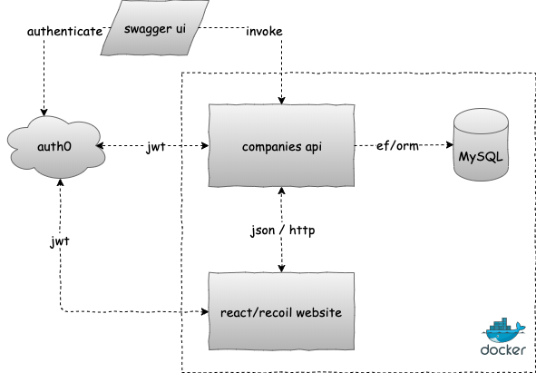

# ak.companies

A sample application showcasing, a variety of technologies, including
MySQL, .NET Core, ReactJS, Auth0, Swagger and Docker.

## Quick Start

If you're too curious to see the application in action before reading along the documentation, here're the steps:

For the `Dockerized` version, simply run:
```bash
docker-compose up 
```

Or, to run the containers in detached mode (background):
```bash
docker-compose up -d
```

*On Windows, if you cannot execute `.sh` files, you can rename the file to `.ps` and use powershell instead*

And that's it, you should have:
- a react front end at http://localhost:3000
- a .net core api at http://localhost:5001
- a swagger ui at http://localhost:5001/swagger

## Architecture



Technical implementation uses the following projects:

### ak.companies.model
Contains domain models and their related business logic and validation rules. *ak.companies.model.test* contains its corresponding unit tests

### ak.companies.api
Simple .net core 3.1 api project. Exposing a RESTful endpoint to handle company model CRUD operations

- *GET api/companies* to get all companies
- *GET api/companies/search?id=,isin=* to retrieve a company by either id or isin
- *POST api/companies* to create a company
- *PUT api/companies/{id}* to update an existing company

unit tests are located at: *ak.companies.api.test*

### ak.companies.db
Contains the EF context and migrations. Also a SQL sump of the database is located there

### ak.companies.web
A React framework website to allow viewing a Company and retrieving a JWT for use with Swagger UI

## Scripts

To run the webapi:
```bash
dotnet run
```

For tests, run this in each respective project folder:
```
dotnet test
```

In dev mode, to apply a migration and update the database, run this command *from inside ak.companies.api as it is the Startup project*

```bash
dotnet ef --project ../ak.companies.db  database update --configuration Development
```

To create and initialize the database:
```bash
./init-db.sh
```